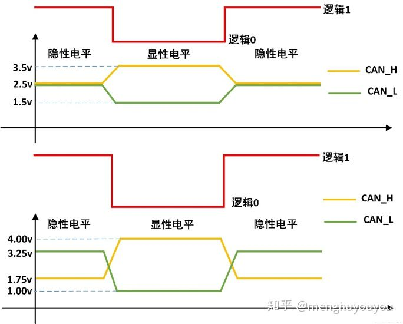
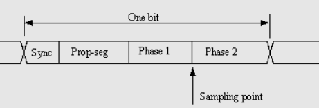

# CAN基础知识介绍
CAN是Controller Area Network(控制器局域网络)的缩写,是ISO国际标准化组织的串行通信协议。由德国电气商博世公司在1986 年率先提出。此后，CAN 通过ISO11898 及ISO11519 进行了标准化。现在在欧洲已是汽车网络的标准协议。
CAN协议经过ISO标准化后有两个标准：ISO11898标准和ISO11519-2标准。其中ISO11898是针对通信速率为**125Kbps~1Mbps的高速通信标准**，而ISO11519-2是针对通信速率为**125Kbps以下的低速通信标准**。
CAN具有很高的可靠性和良好的错误检测能力，广泛应用于汽车计算机控制系统和环境温度恶劣/电磁辐射强及振动大的工业环境。
CAN主要用在两个设备之间的通讯。

## CAN的特点
1. 多主控制。总线空闲时，所有单元都可发送消息，而两个以上的单元同时发送消息时，根据标识符(ID, 非地址)决定优先级。两个以上的单元同时开始发送消息时，对各消息ID的每个位进行逐个仲裁比较。仲裁获胜(优先级最高)的单元可继续发送消息，仲裁失利的单元则立即停止发送而进行接收工作。
2. 系统柔软性。连接总线的单元，没有类似"地址"的信息。因此，在总线上添加单元时，以连接的其他单元的软硬件和应用层都不需要做改变。
3. 速度快，距离远。最高1Mbps(距离<40m)，最远可达10KM(速率<5Kbps)。CAN物理层的形式主要分为闭环总线和开环总线，一个适合于高速通讯，一个适合于远距离通讯(速度慢)。**闭环通讯网络是一种高速、短距离网络**，它的总线最大长度为40m，通信速度最高1Mbps，总线的两端各要求有一个"**120欧**"的电阻。**开环总线网络是低速、远距离网络**，它的最大传输距离1km，最高通讯速率为125kbps，两根总线是独立的、不形成闭环，要求每根总线上各串联有一个"**2.2千欧**"的电阻。
4. 具有错误检测/错误通知和错误恢复功能。所有单元都可以检测错误(错误检测功能)，检测出错误的单元会立即同时通知其他所有单元(错误通知功能)，正在发送消息的单元一旦检测出错误，会强制结束当前的发送。强制结束发送的单元会不断反复地重新发送次消息直到成功发送位置(错误恢复功能)。
5. 故障封闭功能。CAN可以判断出错误的类型是总线上数据错误(如外部噪声等)还是持续的数据错误(如单元内部故障、驱动器故障、断线等)。由此功能，当总线上发生次序数据错误时，可将引起此故障的单元从总线上隔离出去。
6. 连接节点多。CAN总线可同时可同时连接多个单元。可连接的单元总数理论上是没有限制的。但实际上可连接的单元受总线上的时间延迟及电气负载的限制。降低通信速度，可连接的单元数增加；提高通信速度，则可连接的单元数减少。
正是因为CAN协议的这些特点，使得CAN特别适合工业

## 物理层特征
与I2C/SPI等具有始终信号的同步通讯方式不同，CAN通讯兵不是以时钟信号来进行同步的，它是一种异步通信，只具有CAN_High和CAN_Low两条信号线，共同构成一组**差分信号线**，以差分信号的形式进行通讯。
1. **差分信号线**电平为正，逻辑表示也为1，但是电平类型为隐性电平；
2. **差分信号线**电平不为正，逻辑表示为0，但是电平类型为显性电平；

*由于线与机制，所以逻辑0拥有更强的能力，当有一个元件输出0时，则总线为0，这就是为什么逻辑0的电平被称为显性电平。
对于如何将差分信号线/逻辑转化为CAN_H和CAN_L，或者反之的情形，就交给收发器*

## 波特率及位同步
由于CAN属于异步通讯，没有时钟信号线，连接在同一个总线网络中的各个节点会像串口通讯那样，节点间**必须使用约定好的波特率进行通讯**，特别地，CAN还会使用"位同步"的方式来抗干扰/吸收误差，实现对总线电平信号进行正确的采样，确保通讯正常。

## 时序控制
出于时序目的，CAN总线上的每个位都划分成至少4个时间份额。时间份额逻辑上划分成四个组或段

1. 同步段
2. 传播段
3. 相位段1
4. 相位段2

采样发生在相位段1和相位段2之间，在配置CAN收发器的相关寄存器时，往往需要配置

1. BRP。预分频寄存器，用于分配
2. TSEG1/BS1。采样点前的时间，等于传播段+相位段1
3. TSEG2/BS2。采样点后的时间，等于相位段2
4. SJW。再同步补偿宽度，允许CAN收发器自动**调整**相位段1和相位段2的**最大范围**，所以它并不是一个真实占用时间，而是一个**允许调整范围**。因此，SJW为相位段1和相位段2中的最小值，同时它不能超过4，因此 SJW=min（相位段1，相位段2，4）。

- *同步段默认为占用一个时间单元，一个时间单元意味着发送一个逻辑所需的时间，需要包括这四个段。*
- $\frac{1}{t_{sync}+t_{propseg}+t_{phase1}+t_{phase2}}=\frac{1}{n\cdot t_q}=f$]
- $\frac{1}{t_q}=\frac{f_{bus}}{BRP} \rightarrow n\cdot f \cdot BRP =f_{bus}$
- BRP/BS/SJW代表的值A和在寄存器中的值B的关系往往为A-1=B，这是为了利用到B=0来表示A=1这种情况