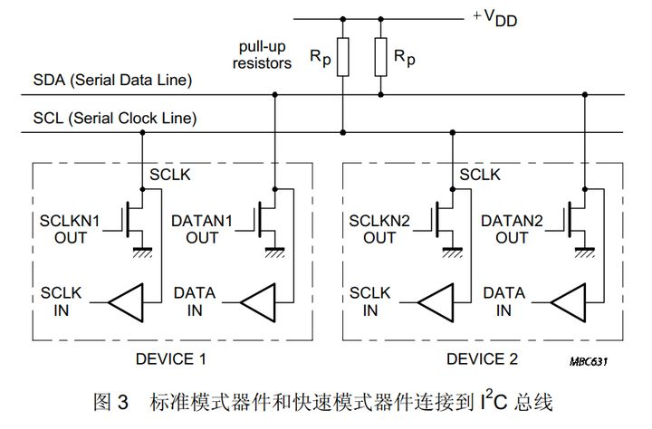
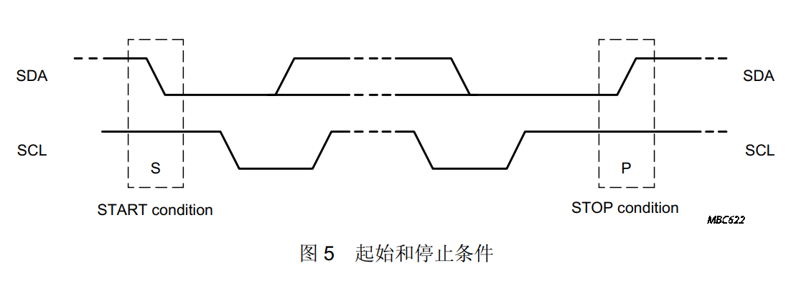
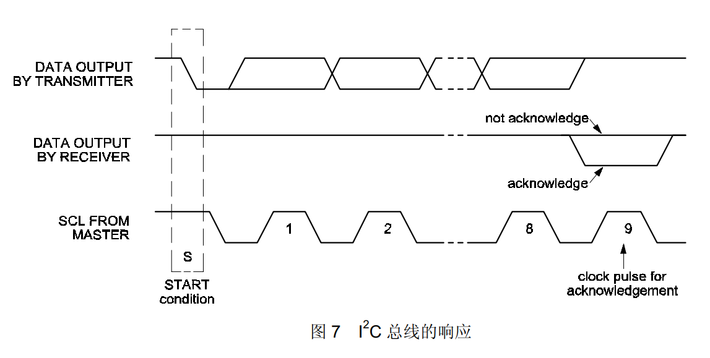
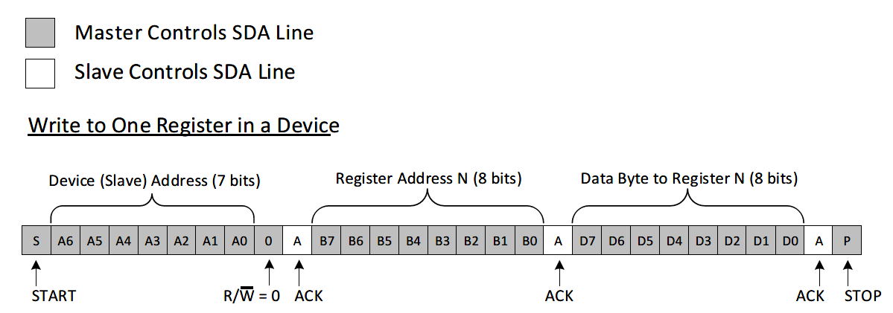
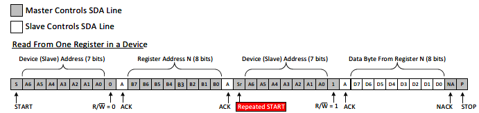

#flashcards 
# 相关概念

I2C总线是由Philips公司开发的一种简单、==**双向二线制同步串行总线**==。它只需要两根线即可在连接于总线上的器件之间传送信息。
<!--SR:!2025-04-29,382,190-->

每个器件都有一个唯一的地址识别，都可作为一个发送器或接收器（由器件的功能决定），器件在执行数据传输时也可以看作时主机或从机

# 特点

- 两条线：SDA数据线，SCL时钟线
- 开漏结构，需要借助上拉电阻实现高电平

# 串行传输

1. 启动条件

    起始条件：==SCL为高电平时，SDA从高电平向低电平切换==；
<!--SR:!2024-06-30,270,210-->

    停止条件：==SCL为高电平时，SDA从低电平向高电平切换==；
<!--SR:!2025-02-07,603,250-->

2. 传输

    每发送8位数据好像，接受数据者(主机/从机)都应该控制SDA线以响应ACK或者NOACK

  

3. 主机写从机

4. 从机写主机（主机读从机）

    与主机写从机不同是，主机会先发送写命令，后发送读命令，最后从机传输数据到主机。

