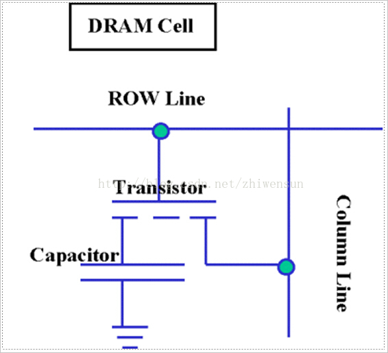
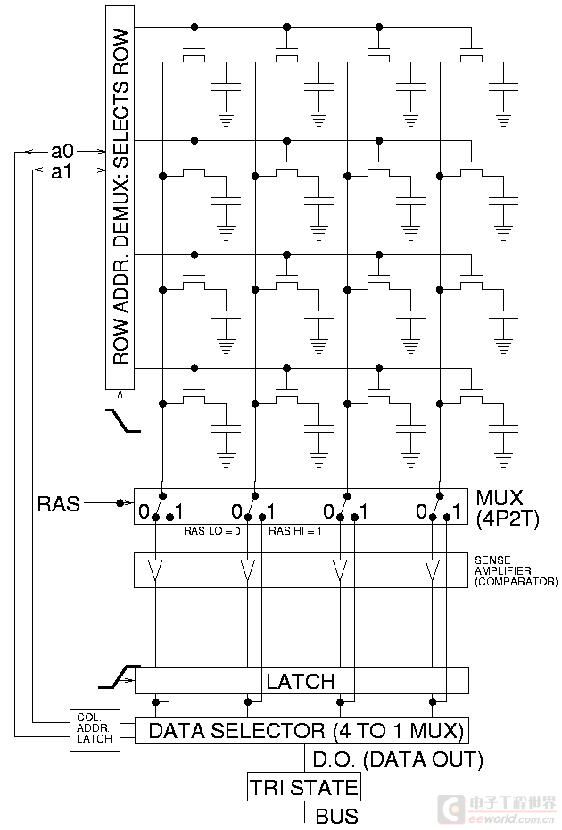

# 概念

DRAM(Dynamic Random Access Memory)，即动态随机存取存储器。

# 特点

- 断电会丢失数据
- 行列地址公用一个管脚
- DRAM 只能将数据保持很短的时间。为了保持数据，DRAM使用电容存储，所以必须隔一段时间刷新(refresh)一次，如果存储单元没有被刷新，存储的信息就会丢失。

# 工作原理

单个cell如图所示：

- 电容器的状态决定了这个DRAM单位的逻辑状态是1还是0
- 一个充电的电容器在数字电子中被认为是逻辑上的1，而“空”的电容器则是0
- 电容器不能持久的保持储存的电荷，所以dram需要不断定时刷新
- 电容的充放电需要一定的时间，虽然对于内存基本单位中的电容这个时间很短，只有大约0.2-0.18微秒，但是这个期间内存是不能执行存取操作的
- 对dram执行读的操作，会使得电容放电，也就是破坏信息，因此需要执行写回操作，这增加了存取操作的时间。

存储器结构，如图：
