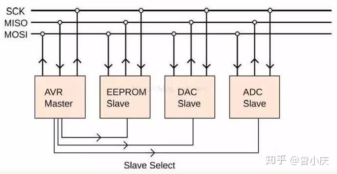
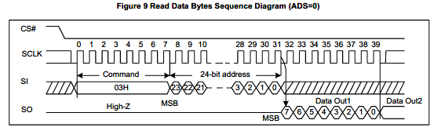

# 概念

SPI, Serial Peripheral Interface, 串行外围设备接口

# 特点

## 主从模式（Master-Slave）

主机通过片选（Slave Select）来控制多个Slave；Slave的时钟由主机Master提供。

## 四条线

- SS：片选设备
- SCK：提供时钟
- MISO:Master Input Slave Output，主机接受
- MOSI:Master Output Slave Input，主机发送

## 同步传输

1. 要开始SPI通信，主机必须发送时钟信号，并通过使能CS信号选择从机。片选通常是低电平有效信号。

2. SPI是全双工接口，主机和从机可以分别通过MOSI和MISO线路同时发送数据。在SPI通信期间，数据的发送（串行移出到MOSI/SDO总线上）和接收（采样或读入总线(MISO/SDI)上的数据）同时进行。

3. SPI需要指定器件的写入地址，如图中的Command+Address

注：数据采样的时间点由CPOL（时钟极性）和CPHA（时钟相位）决定

- CPOL：或者叫**空闲电平设置**😂；时钟的极性CPOL决定在总线空闲时，同步时钟SCk信号线上的电位是高电平还是低电平。当时钟极性为0时（CPOL=0），SCK信号线在空闲时为低电平；当时钟极性为1时（CPOL=1），SCK信号线在空闲时为高电平。

- CPHA：或者叫**采样沿个数设置**😂；时钟的相位CPHA用来决定何时进行信号采样。
当时钟相位为1时（CPHA=1），在SCK信号线的第二个跳变沿进行采样；当时钟相位为0时（CPHA=0），在SCK信号线的第一个跳变沿进行采样。

- 这里的跳变沿究竟是上升沿还是下降沿？取决于时钟的极性。当时钟极性为0时，取下降沿；当时钟极性为1时，取上升沿；
