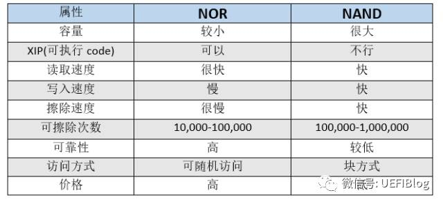

# flash

flash:非易失性存储介质，可分为NOR和NAND两种，flash在写入前都需要进行擦除。
```
flahs共性

A. 都是非易失存储介质。即掉电都不会丢失内容。

B. 在写入前都需要擦除。实际上NOR Flash的一个bit可以从1变成0，而要从0变1就要擦除整块。NAND flash都需要擦除。
```

不完全查证，NOR先于NAND发明。两者的对比如下：



需要注意的最重要一点：NOR支持随机访问，因此可以执行code。
```
NOR Flash和普通的内存比较像的一点是他们都可以支持随机访问，这使它也具有支持XIP（eXecute In Place）的特性，可以像普通ROM一样执行程序。这点让它成为BIOS等开机就要执行的代码的绝佳载体。
```
