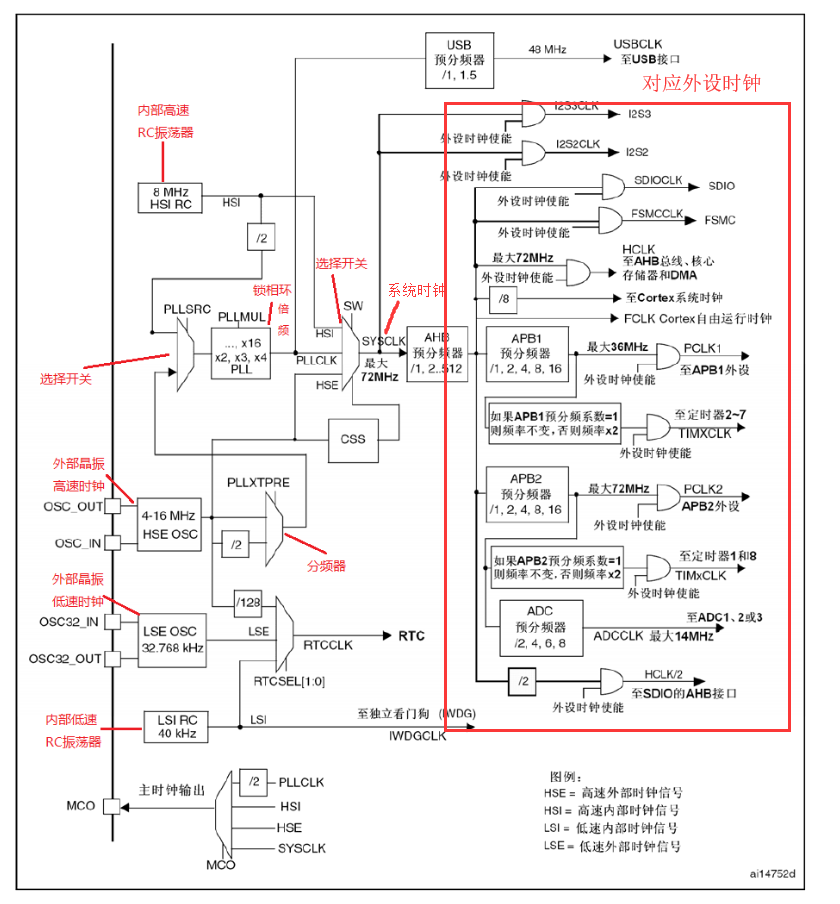

# 引言

好久没看到这么有条理的文章了，（可能因为这部分比较简单）

# 概念

RCC：Reset and clock control（复位和时钟控制）

# 时钟

时钟是单片机运行的基础，时钟信号推动单片机内各个部分执行相应的指令。时钟系统就是CPU的脉搏，决定cpu速率，像人的心跳一样 只有有了心跳，人才能做其他的事情，而单片机有了时钟，才能够运行执行指令，才能够做其他的处理 (点灯，串口，ADC)，时钟的重要性不言而喻。

为什么 STM32 要有多个时钟源呢？

STM32本身十分复杂，外设非常多  但我们实际使用的时候只会用到有限的几个外设，使用任何外设都需要时钟才能启动，但并不是所有的外设都需要系统时钟那么高的频率，为了兼容不同速度的设备，有些高速，有些低速，如果都用高速时钟，势必造成浪费

并且，同一个电路，时钟越快功耗越快，同时抗电磁干扰能力也就越弱，所以较为复杂的MCU都是采用多时钟源的方法来解决这些问题。所以便有了STM32的时钟系统和时钟树

# 时钟树

**从左到右可以简单理解为  各个时钟源--->系统时钟来源的设置--->各个外设时钟的设置**

## 时钟源

STM32 有4个独立时钟源:HSI、HSE、LSI、LSE。

1. HSI是高速内部时钟，RC振荡器，频率为8MHz，精度不高。
2. HSE是高速外部时钟，可接石英/陶瓷谐振器，或者接外部时钟源，频率范围为4MHz~16MHz。
3. LSI是低速内部时钟，RC振荡器，频率为40kHz，提供低功耗时钟。
4. LSE是低速外部时钟，接频率为32.768kHz的石英晶体。

> 注：32768=2^15

其中，LSI作为IWDGCLK(独立看门狗)时钟源和RTC时钟源 而独立使用；HSI高速内部时、HSE高速外部时钟经过分频或者倍频作为系统时钟来使用。

> PLL：锁相环，通过对比基准频率（由稳定的频率源担当）和VOC频率，从而调整VOC的控制电压，利用闭环控制实现VOC的稳定频率输出。其频率输出为基准频率的倍频。

> VOC:压控振荡器，一个非常简单的振荡电路，频率由电压控制。但是不够稳定，频率可能发生失真。

**举个例子**：Keil编写程序是默认的时钟为72Mhz，其实是这么来的：外部晶振(HSE)提供的8MHz（与电路板上的晶振的相关）通过PLLXTPRE分频器后，进入PLLSRC选择开关，进而通过PLLMUL锁相环进行倍频（x9）后，为系统提供72MHz的系统时钟（SYSCLK）。之后是AHB预分频器对时钟信号进行分频，然后为低速外设提供时钟。

或者内部RC振荡器(HSI) 为8MHz/2 为4MHz 进入PLLSRC选择开关，通过PLLMUL锁相环进行倍频（x18）后 为72MHz