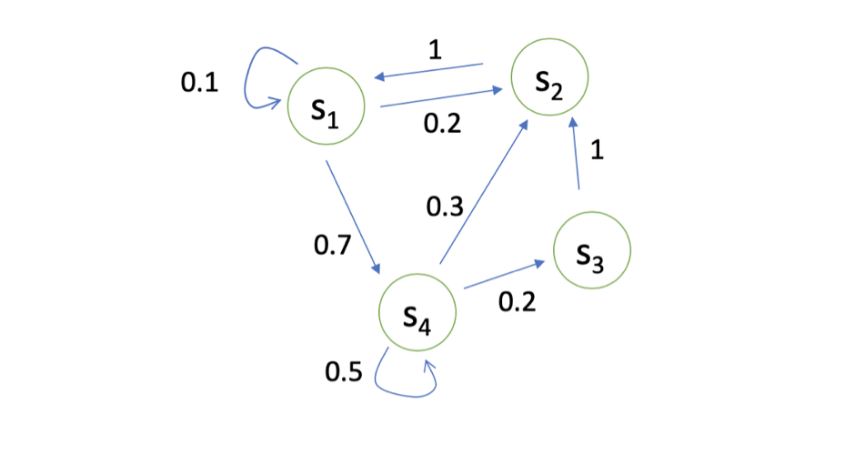
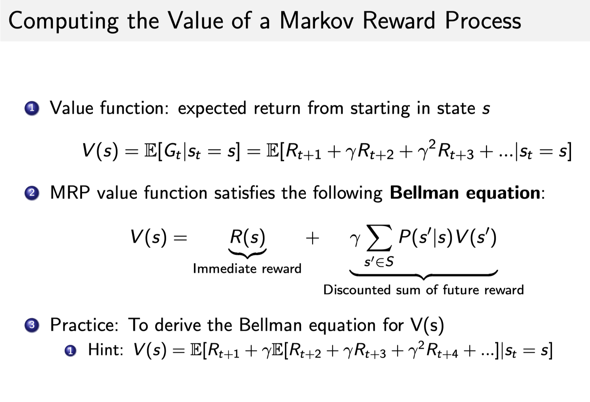
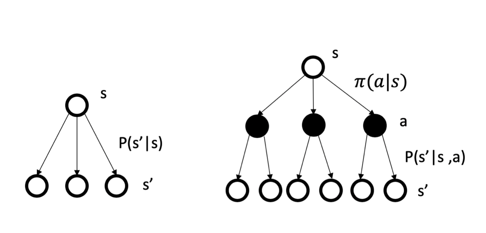

# 第二章概述
主要观察一下：
1. 马尔可夫链
2. 马尔可夫奖励
3. 马尔可夫决策过程

## 马尔可夫链

如果说一个状态转移是符合马尔可夫的，那就是说一个状态的下一个状态只取决于它当前状态，而与它当前状态之前的状态都没有关系。

## 马尔可夫奖励过程

马尔可夫奖励过程是马尔可夫再加上了一个奖惩函数。奖励函数 R 是一个**期望**，就是说当你到达某一个状态的时候，可以获得多大的奖励，然后这里另外定义了一个 discount factor γ 。

为什么说是**期望**呢？为什么需要折扣系数γ呢？因为这个R是一个当前状态下一条**轨迹的期望**。在计算得到轨迹的的R奖励后，把所有的轨迹叠加起来，则形成当前状态的**价值**。具体的计算过程：

Bellman Equation 定义了当前状态跟未来状态之间的这个关系。未来打了折扣的奖励加上当前立刻可以得到的奖励，就组成了这个 Bellman Equation。

*Discount factor 可以作为强化学习 agent 的一个超参数来进行调整，然后就会得到不同行为的 agent。*

在具体实现中，存在两种计算价值函数的方法：
1. 蒙特卡洛法。
2. 动态规划法，更像是迭代法

## 马尔可夫决策过程
- 相较于马尔可夫奖励过程，多了一个决策过程，也就是多了一个动作
- 相应地，状态转移函数多了一个动作的自变量
- 相应的，价值函数也多了一个动作的自变量

### MDP和MRP
策略定义了在某一个状态应该采取什么样的动作，可以采取概率函数来描述这个策略：$\pi(a \mid s)=P\left(a_{t}=a \mid s_{t}=s\right)$。
因此原本的$P(s'|s)\rightarrow P^{\pi}\left(s^{\prime} \mid s\right)=\sum_{a \in A} \pi(a \mid s) P\left(s^{\prime} \mid s, a\right)$，原本的$R(s)\rightarrow R^{\pi}(s)=\sum_{a \in A} \pi(a \mid s) R(s, a)$，就是在状态变化过程中多了一层：

相应地，在计算价值函数时，需要先采样动作，然后采样下一个状态，从而计算价值的期望。这里引入Q函数，Q函数表示在某一状态下某一动作带来的价值，价值函数表示某一状态下给定策略带来期望价值。两者的关系如下：

$$ v^{\pi}(s)=\sum_{a \in A} \pi(a \mid s) q^{\pi}(s, a) $$

$$ q^{\pi}(s, a)=R_{s}^{a}+\gamma \sum_{s^{\prime} \in S} P\left(s^{\prime} \mid s, a\right) v^{\pi}\left(s^{\prime}\right) $$

### 策略评估

策略评估即评估这个策略会产生多大的价值，具体来说，在某一策略下计算$v^{\pi}\left(s\right)$。

### 预测和控制

- 预测：给定MDP和策略，计算价值
- 控制：给定MDP，去寻找最佳价值和策略

实际上，这两者是递进的关系，在强化学习中，我们通过解决预测问题，进而解决控制问题。

动态规划应用于 MDP 的规划问题(planning)而不是学习问题(learning)，我们**必须对环境是完全已知的(Model-Based)，才能做动态规划**，直观的说，就是要知道状态转移概率和对应的奖励才行。

### 策略评估的数值计算方法
Policy evaluation 的核心思想就是把如下式所示的 Bellman expectation backup 拿出来反复迭代，然后就会得到一个收敛的价值函数的值。

$$ v_{t+1}(s)=\sum_{a \in \mathcal{A}} \pi(a \mid s)\left(R(s, a)+\gamma \sum_{s^{\prime} \in \mathcal{S}} P\left(s^{\prime} \mid s, a\right) v_{t}\left(s^{\prime}\right)\right) $$

### 马尔可夫决策过程控制

马尔可夫决策过程控制是说如果我们只有一个马尔可夫决策过程，如何去寻找一个最佳的策略，然后可以得到一个最佳价值函数。可以通过**策略迭代**和**价值迭代**来解马尔可夫决策过程的控制问题。

#### 策略迭代

策略迭代由两个步骤组成：策略评估和策略改进。
1. 给定当前的策略函数来估计 V 函数
2. 进一步推算出它的 Q 函数。$q^{\pi_{i}}(s, a)=R(s, a)+\gamma \sum_{s^{\prime} \in S} P\left(s^{\prime} \mid s, a\right) v^{\pi_{i}}\left(s^{\prime}\right)$
3. 得到 Q 函数过后，我们直接在 Q 函数上面取极大化，在这个 Q 函数上面做一个贪心的搜索来进一步改进它的策略 $\pi_{i+1}(s)=\underset{a}{\arg \max } ~q^{\pi_{i}}(s, a)$